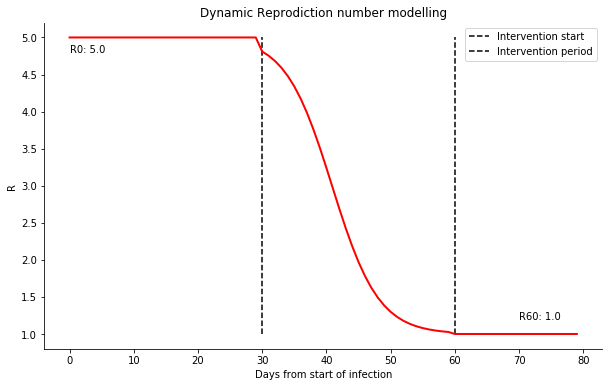
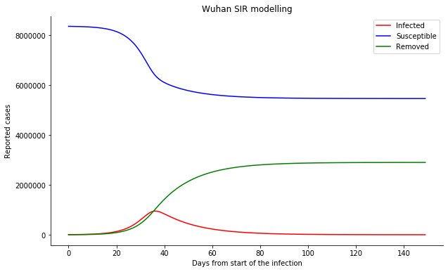
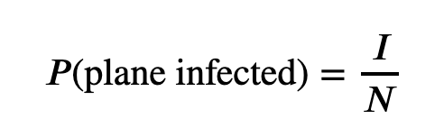
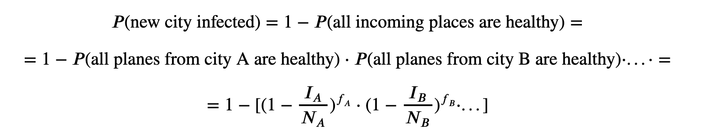

# COVID-19
Modelling the disease spread.

The approach is based on combining two general strategies to infection modelling: using [Susceptible-Infectious-Recovered/Removed (SIR)](https://www.maa.org/press/periodicals/loci/joma/the-sir-model-for-spread-of-disease-the-differential-equation-model) model for the city-level spread, and simultaneously modelling the spread of the decease through the air-traffic network.

Algorithm pseudocode:

1. Initialize `INFECTED_CITIES` with Wuhan
2. For `day` in `simulation_days`
    1. For `infected_city` in `INFECTED_CITIES`:
        1. Get all `airports` of the `infected_city`
        2. Get all `connections` for the `airports`
        3. For `susceptible_city` in `connections`:
            1. Calculate probability of infection of `susceptible_city`
            2. If `susceptible_city` is infected - update `INFECTED_CITIES`
        4. Next `day`

---
## City infection spread

To model the spread of infection within a particular city we use a homogeneous [Susceptible-Infectious-Recovered/Removed (SIR)](https://www.maa.org/press/periodicals/loci/joma/the-sir-model-for-spread-of-disease-the-differential-equation-model) model with several assumptions. Although quite simplistic, the model proves to be reasonable for approximating the COVID-19 infection spread. There are several reasons for this efficiency:

1. A person becomes infectious already during the incubation period (source: [Johns Hopkins University](https://www.jhsph.edu/news/news-releases/2020/new-study-on-COVID-19-estimates-5-days-for-incubation-period.html?utm_source=feedburner&utm_medium=feed&utm_campaign=Feed%3A+JHSPHNews+%28Public+Health+News+Headlines+from+Johns+Hopkins%29)). That means there is a direct transition from Susceptible to Infectious bypassing the Exposed step as in SEIR model
2. There is no vaccine at the moment, so it's impossible to prevent the decease from spreading using traditional herd immunization strategies. For SIR model that means that all city population is susceptible unless strict quarantine is enforced (more on that later)
3. The long incubation period (14 days median, Ibid) and unsymptomatic nature for the majority of infected allow the decease to spread undetected up until first symptomatic infections are detected and tested. That once again aligns with the initial dynamics of the SIR model.

The major idea that we've implemented to address the changes in the infection rate due to social distancing and quarantine measures is dynamically modelling the R0 value. The idea is straightforward - adjust R0 in response to the preventive measures. As a baseline, we took the Wuhan example of preventive measures and their approximate timelines.

During the first days, the infection spreads largely undetected, hence, R0 value is close to its upper bound. On average, after the median incubation period of 14 days, first social distancing measures are taken into action which drives R0 down to its average values. Finally, after approximately 1-month period strict quarantine measures are enforced, including travel bans, area lockdowns, etc. That results in R0 dropping down to its minimum values:

Finally, for each infected city we run an SIR model to get the number of infected people for all days of simulation.

---

## Network infection spread

To model the infection spread through the airline traffic network we need to calculate the probability that a given susceptible city would be infected by its neighbouring infected city on a given day.

We consider a city infected if at least one infected plane landed in this city. Hence, first we need to calculate the probability that the plane coming from the infected city is infected itself:

,

where *I* - number of infected in the city, *N* - total population of the city.

Next, we can calculate the probability that the city is infected:

,

Intermediate results of the modelling can be found on plots below.

Cities.

Cities and directions of infection spread.

